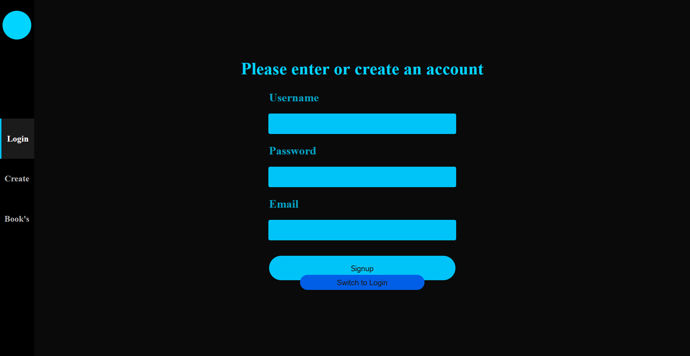
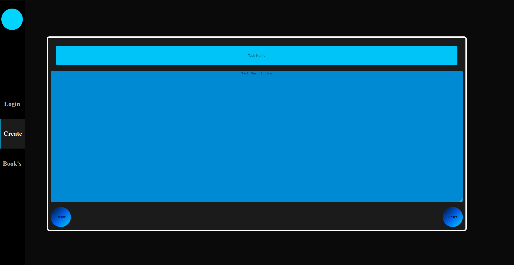
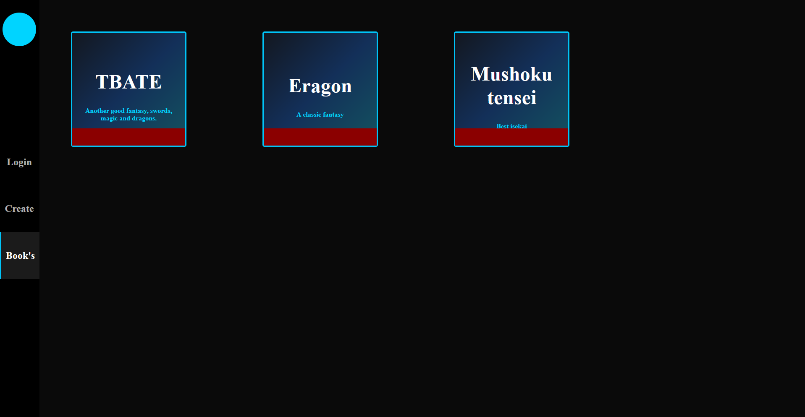

### Description
A simple book managment app showing CRUD skills. Follows a specific backend style using ORM's and some custom middleware.
## Screenshots




## How to run
```
//Reinstall dependants
cd BookMapp
npm install
//Reinstall dependants
cd server
npm install
```
## Env
In the route of BookMapp create and .env with this inside a 'pointer to the server'
```VITE_API_BASE_URL=http://localhost:3000```
For the backend go to the root of the server directory and create a .env file with this inside
```
MY_HOST=127.0.0.1
MY_USER=root
MY_PASS='Mypassword'
MY_DB='mydb'

PORT=3000
FRONTEND_URL=http://localhost:5173
ACCESS_TOKEN_SECRET=supersecret
```
Replace the related items with your db info this uses mySQL
## Db
As for the database itself bellow is the tables and a sequelize command to just sync the database with the model
```sequelize.sync({ alter: true })```
Or
```-- Create the User table
CREATE TABLE User (
id INT AUTO_INCREMENT PRIMARY KEY,
email VARCHAR(255) NOT NULL UNIQUE,
password VARCHAR(255) NOT NULL,
name VARCHAR(255) NOT NULL,
createdAt DATETIME NOT NULL DEFAULT CURRENT_TIMESTAMP,
updatedAt DATETIME NOT NULL DEFAULT CURRENT_TIMESTAMP ON UPDATE CURRENT_TIMESTAMP
);

-- Create the books table
CREATE TABLE books (
BookId CHAR(36) PRIMARY KEY,
BookName VARCHAR(255) NOT NULL,
Description VARCHAR(255),
UserId INT NOT NULL,
createdAt DATETIME NOT NULL DEFAULT CURRENT_TIMESTAMP,
updatedAt DATETIME NOT NULL DEFAULT CURRENT_TIMESTAMP ON UPDATE CURRENT_TIMESTAMP,
FOREIGN KEY (UserId) REFERENCES User(id) ON DELETE CASCADE
);
```
